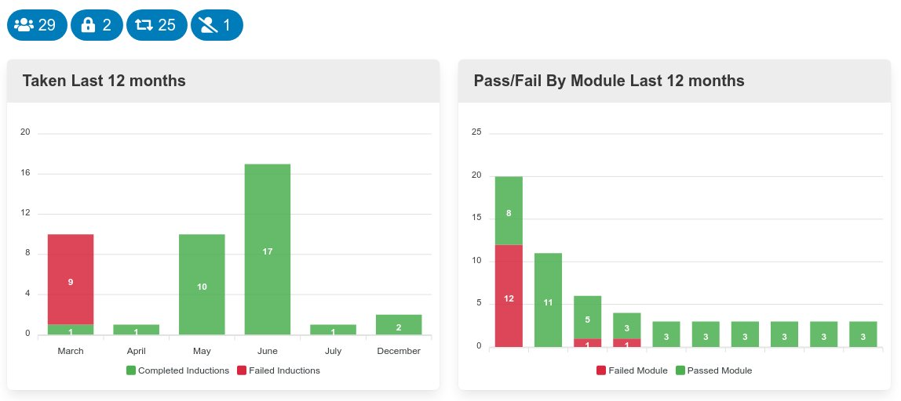
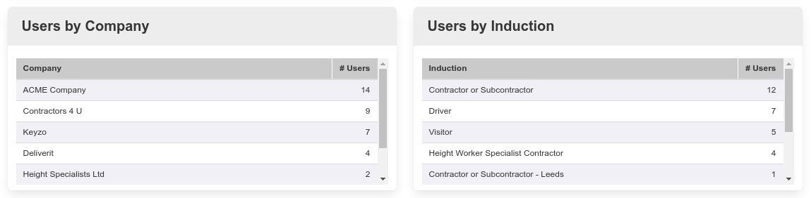
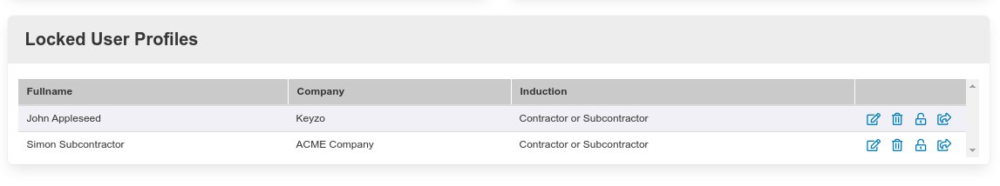
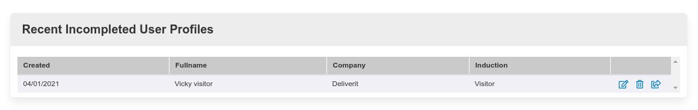
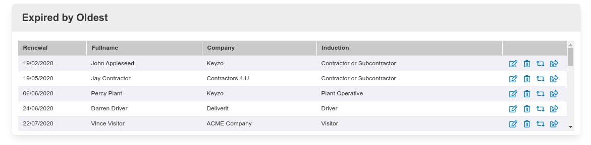

This is the main system dashboard. It forms a top level overview of the inductions system, including the ability to admin common task more effectively. It is broken down into a series of charts and graphs and these shall now be discussed below.

These 2 charts show different views of the induction data. The chart on the left shows the actual induction pass and failure rates within the last 12 months. The chart on the right shows the pass failure rate by modules over the last 12 months. The real focus here is looking at any failures. As you can see here initially the induction and module failures were high. This indicates a problem with the induction content or questions and answers. If you start to see high induction failures you should investigate to see if there is a problem with the content. A few module failures is to be expected as sometimes people rush or don't read things correctly. On second or third attempts however they are managing to pass the induction with no induction failure.

Above the chart is a series of badges. These are links to filtered data views. Hovering over the badges will show you what they represent and clicking on them will take you to that view.

These 2 grids give you a view of the break down of the inductions taken. The first ranks the inductions by company and the 2nd grid ranks the inductions by induction type.

This grid shows the number of locked user profiles. Here 2 users are currently prevented from taking an induction. The reason will depend on your configuration, but is either because they have failed an induction and are awaiting a retest, or their user record's have just been created and they cannot proceed immediately to the induction whilst they are not on site.

The end column shows the action bar and you can perform a number of items directly from this grid - such as viewing / editing their user record, or unlocking their induction profile.

This Grid shows a list of users with uncompleted user profiles order by the oldest first. From here you can archive any unneeded records or send a follow email prompting them to complete the details. 

Here you can see a list of expired inductions order by the oldest first. From here you can perform various actions: For example archive the record or mark user as requiring renewal. In this case the renewal date will be set to today and an induction renewal email will be sent.