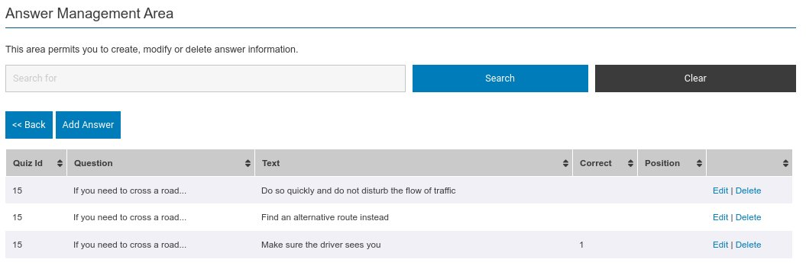
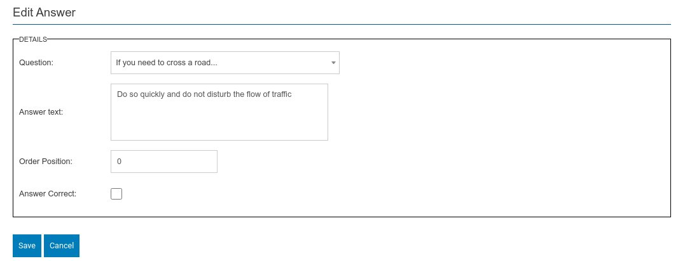

This is the final stage in assigning questions and answers against a module.

From within the now familiar listing screen you can edit, create and delete answers as well as stepping back to the question management screen.

The list shows the question and list of answers against the question. It also shows which answer or answers are the correct response.

## Create / Edit Answer

From within this screen you can create new or edit existing answers. 

It requires the following pieces of information.

* The question to which the answer corresponds to.
* The answer itself.
* The order position of the answer. Only needed for answers such as all of the above / below or when the question / answer is audio described i.e. Answer A ........... Answer B .............
* Finally a mark denoting if this is a correct response to the question.