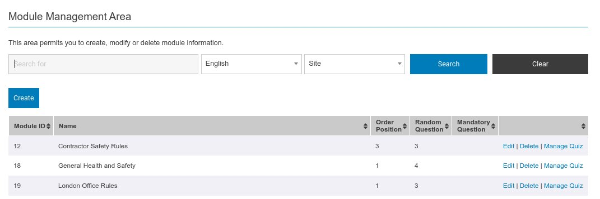

This is the hub of the content creation part of the system. 

Again the search bar can be used to help filter down the display. Here general induction content is shown along with site specific content i.e. London, as no site filter has been specified.

Against each row the action column acts to group together the operation you can perform. As well as the standard edit and delete functions you can also click 'Manage Quiz'. This will take you to the first stage of adding questions and answers to a given module.

:::info

If you are managing multi language content within the system - you need to select your language in the search bar to amend or create content associated with it.

:::