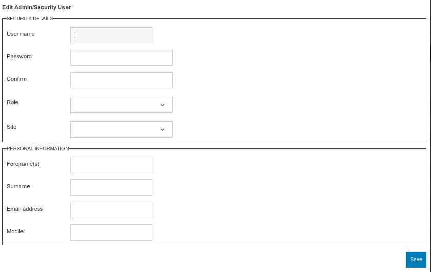

From within this screen you can create a new admin user. The actual configuration of this screen will depend on your requirements. 

Username - Unique username for the admin user

Password - Password for the user can be altered after login. Password strength can be configured.

Confirm - Confirmation of Password.

Role - again this is configurable but is normally

* Admin - used for full administration access.
* Host - limited user creation and ability to host a specified users.
* Security - no user creation ability to view users induction statuses.
* Supervisor - limited user creation.

Site - If multi site is enabled this will be a list of sites. If specified this admin user will only be able to see details pertinent to this site.

Finally there are the user details themselves.

:::note

Admin users do not take up any licences and are not subject to Inductions themselves. If an admin user requires an Induction then a normal user record must also be created.

:::