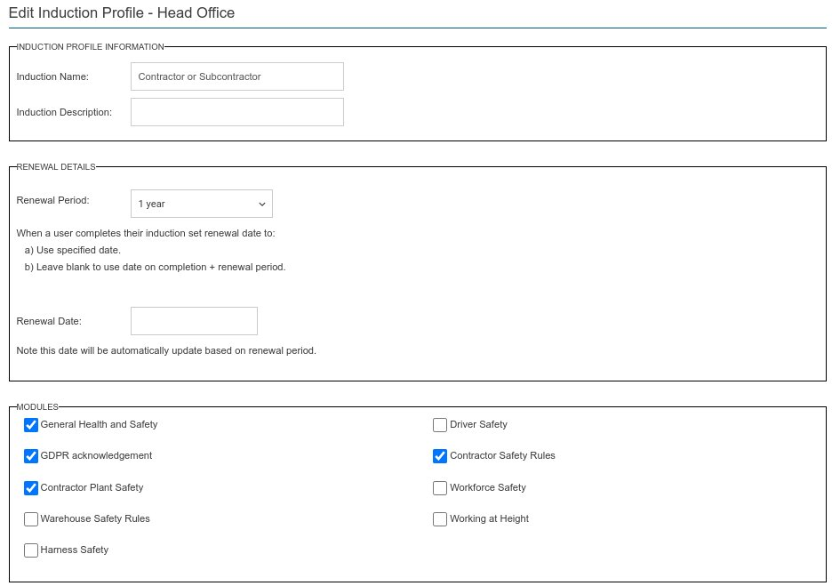

This is the induction create & edit screen. 

As you can see there are 3 main sections

### Induction Profile Information 

* Induction Name - This is mandatory and must be unique.
* Induction Description - An optional description.

### Renewal Details

* Renewal Period - The validity period of the induction.
* Renewal Date - Optional renewal date. If supplied inductions will require renewal on or before this specific date. If this is not supplied inductions will require renewal from the date they are taken plus the renewal period.

### Modules

* A mandatory list of modules that this induction is composed of.

:::note

The order of the module list is determined by their order position defined against each module. If you want to reorder the modules on an existing induction - you must make an edit to the induction this will save the current module order against the induction. To make an edit you must actually change an item and then click save. You can then remove this change and re-save.  

:::