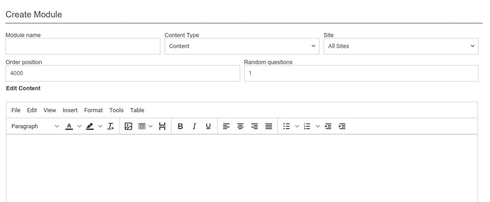

This is the module creation / editing screen. It is composed of a main content editing area and a top details bar.

## Details Bar

* Module Name - this is required and must be unique.
* Content Type - this defaults to allow content creation within the main editing area, but can also be used to import from various formats

  * Video - Allows import of a single video file in mp4 h264 format. It must be less than 100Mb in size.
  * Slides - Import a series of images and compose a slide show from them. Normally used in conjunction with export from MS Power Point.
  * HTML - Import HTML and supporting images. Normally used in conjunction with Export from MS Word.
  * PDF - Import a PDF file and embed this into this module playback.
  * Content - Allows editing within the main editor. Can be used to create new content from scratch, or to adjust some content that has been imported.
* Site - Depending on your configuration, you will be able to specify if this content is site specific from within this drop down.
* Order position - This is the numeric order that modules are shown in an induction. It will default to the last module order position + 1000. This allows plenty of adjustment should you need to change the order position. If you do need to change the order position, space out the modules so that other modules can be slotted in between them.
* Random questions - Specify the number of questions to ask from the question pool for this module.

:::info

A quiz with questions and answers can be defined against each module. The random questions option allows you to select how many questions from this pool to ask. You can also specify when creating the question if it is mandatory. Mandatory questions will always be asked and are in addition to the number of random questions.

:::

## Content Editor

The main content editor provides a number of features to allow you to create or alter content. It is a full WYSIWYG 'what you see if what you get' editor. From within here you can create tables, add headings and styles, and import images - indeed most things you would expect from word processing application. However it is limited in functionality compared to a **'Fully Featured'** word processing application e.g. it lacks grammar and full spell checking abilities as well as review tools. We would therefore encourage you to use your current office tools and import your content instead, and use this for only minimal styling changes and adjustments.

:::note

Once you have imported content and saved the module. If you re-edit that module you will see your imported content within the main content editor.

:::