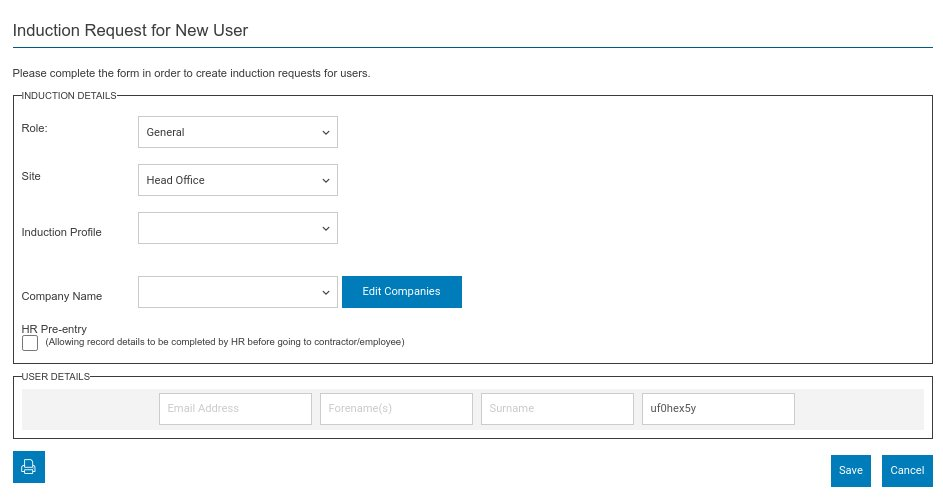

From within this screen you can create a new user. The actual configuration of this screen will depend on your requirements. 

The screen will always include a Role, Site, Induction and a bottom row to enter the user details.

* Role - again this is configurable but is normally either

  * General - used for internal employees
  * Contractor - used for external employees these can be assigned a Host
  * Guest - used for visitors or guests these are assigned a Host.
* Site - If multi site is enabled this will be a list of sites. This will be the main location of the user.
* Induction - The induction profile to complete. This is filtered by site where appropriate.

Finally there is the user details row or rows - this will depend on your configuration. It will always contain Forename(s), Surname and Username fields. It can also contain an optional email field. If your system is configured for pass code only entry, the Username will be auto generated and be the pass code. Otherwise it will be derived from with the email or Forename(s) / Surnames. In each case the Username can be **manually overwritten but it must be unique.**

**:::**info

When a user is created an induction invite will be sent to either their email address or via SMS if configured. They will then be able to complete their user record and depending on configuration proceed to take an induction.

:::