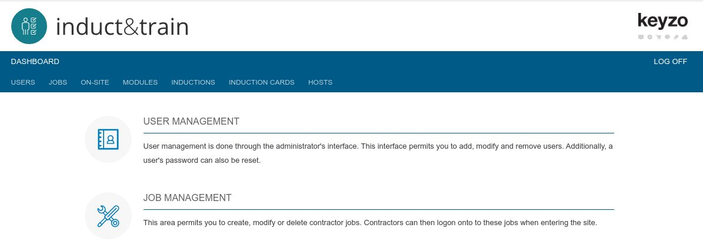
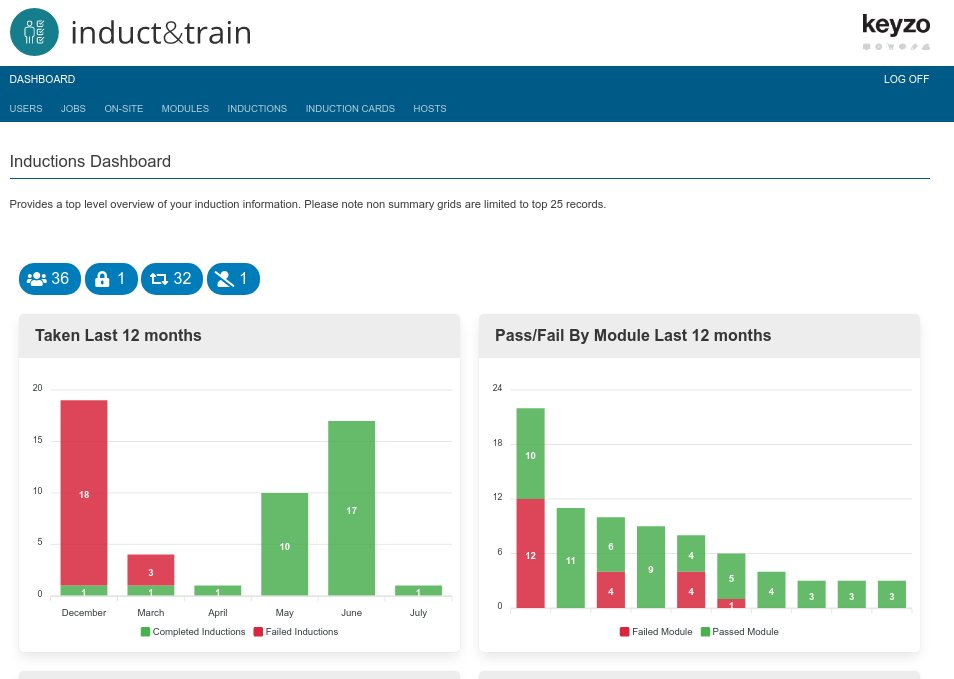
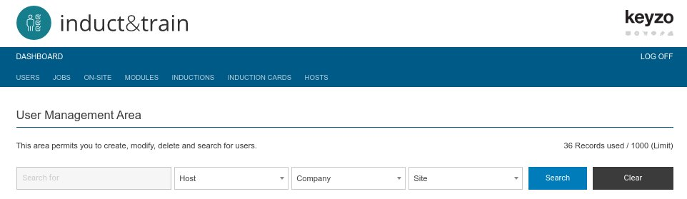

The main administration interface can be found under the login available at **yourcompany.**inductions.net/admin_login.php

:::note

The system will default to the normal end user login screen **yourcompany.**inductions.net. You can navigate to the admin login from here  by going to the top left hand corner of the screen, and clicking once the cursor has changed to a hand.

:::

## Admin Dashboard

Once logged in you will be taken to the main dashboard, dependant on configuration this will either be a navigation list or the full main dashboard e.g:

### Navigation Dashboard

### Full Admin Dashboard

## Overview

The system is composed a number of key elements 

* Main navigation bar at the top - this is likely different on your system and shows the main available features within induct & train.
* Search bar - all of the listing screens comprise a common search bar. You can use the inbuilt drop down controls to filter the data. At the start of the search bar is a search text area that you can use to search for a specific term. The drop down controls and search terms will change based on your configuration and the specific listing screen.
* Finally the main content window will either show a listing screen or an edit / creation screen.

  

  We will now explorer the main areas of the system starting with users.