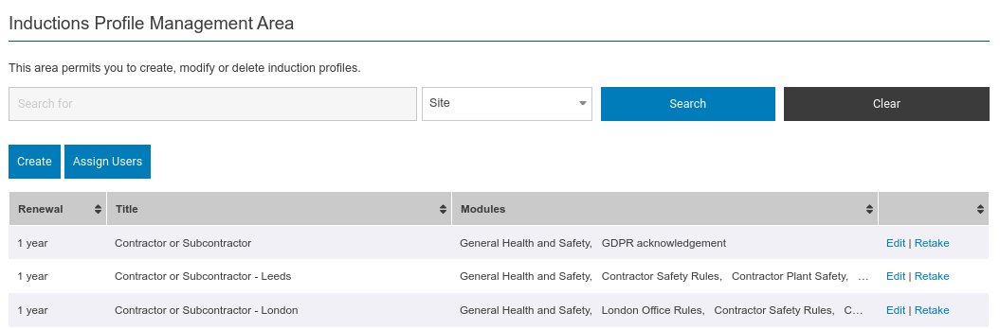

Inductions are what the end user takes when they login to the system. They are comprised of a series of modules which hold the induction content and any questions & answers. 

Below is the induction management list screen. 

From within this screen you can see at a glance which modules are associated with which inductions. If the list of modules is too large to fit into a single row - then you can hover over the modules to see the full list for that row. You can also create new inductions and edit existing inductions.

:::note

The search bar might contain different filters based on your system configuration and you might also not see the assign users button. 

:::

Finally using the last option in the actions column **'Renew'** you are able to mass revoke all passed inductions and require them to be renewed. You would use this if you have made significant changes to an existing module or if you have added additional modules, and need your existing users to retake the induction. 

:::info

When using the **'Renew'** option above, the individual users will be sent a renewal notice, so that they know to retake the induction. Also their current status against that induction will be shown as a red dot.

:::