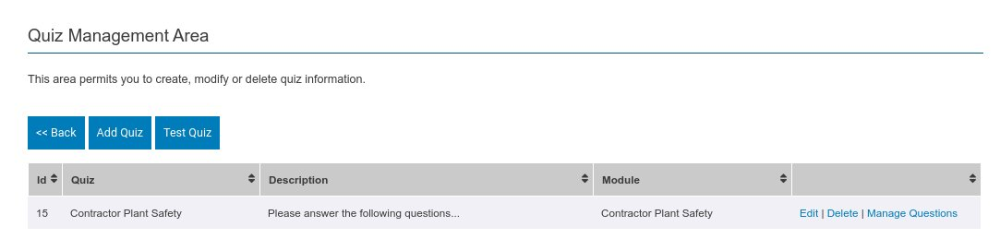
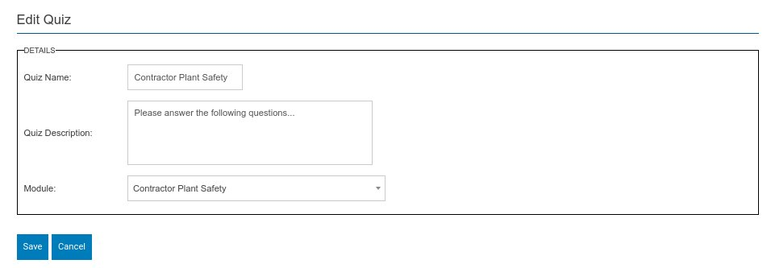

There are a number of steps in order to assign questions and answers against a module. Each stage is a simple list and edit screen that follows a similar pattern. 

The first of these is the quiz management area shown below. 

From here you can create one or more quizzes for the questions and answers to reside within. Normally only a single quiz is needed and this is created here.

:::info

In order to test what a module looks like including questions and answers you can use the **Test Quiz** button. You can skip through content slides here, and also you can skip video playback and jump straight to any questions.

:::

## Quiz Create / Edit

Here is an example quiz edit screen.

A quiz requires the following 

* A name for the quiz
* A description for the quiz which can be a generic or specific introduction text.
* A module that the quiz is attached to - this will default to the module you came into this screen from but can be altered.