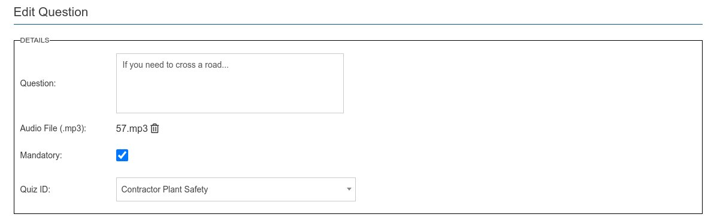

This is the second stage in assigning questions and answers to modules.

This is the question listing screen and includes the familiar search bar and action column - with navigation to the manage answers. Notice also the Mandatory column which denotes any questions that are required to be asked.

## Question Create / Edit

Below is the question edit / creation screen.

This is composed of the following items.

* A required question.
* An optional audio mp3 file which asks the questions and also the spoken answers.
* Mandatory - check this if question is always asked. This is in addition to any random questions.
* Finally define which quiz this question relates to. Normally this will be set for you from the quiz you clicked managed questions against.