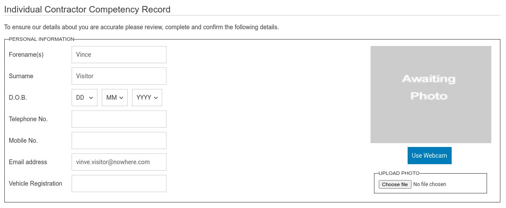
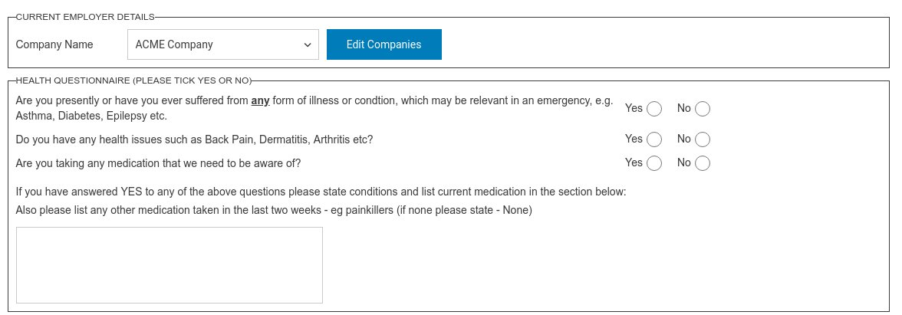
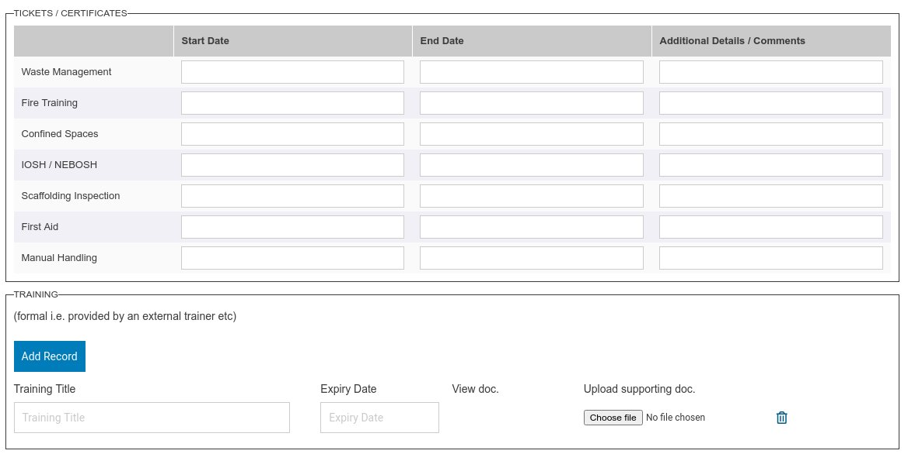
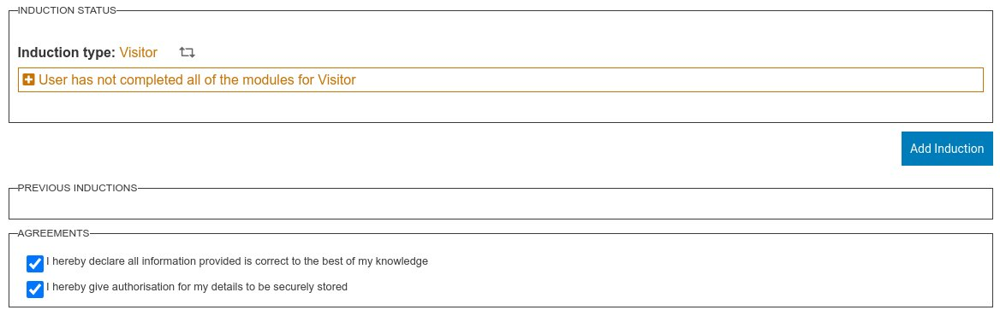

This screen shows the user record. It is the most configurable screen within the system and varies significantly from system to system. It can contain only a minimal amount of fields such as Forename(s), Surname and Induction Profile. It can also extend to several screens of information.

Also the configuration can be linked to the user role. Such that different information can be captured for visitors vs employees or contractors.

The details entered into this screen are confirmed by the end user before being allowed to complete an induction and this consent is retained and audited. 

Below are screen shots and a brief description of each configurable section.

The above Health Questionnaire can be configured to suit any of your needs. 

The certificate section can be configured to have any predefined certificates or  required qualifications within it. These can also be linked to an induction type. The training section is managed by the end users themselves and can be used to show any training qualifications they have completed including supporting evidence.

These are the last panels and are always required. The add induction button is only available if multi profiles has been enabled. The induction status can be extend to show the individual status of the modules. Dependent on configuration there is also the ability for an administrator to mark the induction as completed from here with a qualifying reason. The reason is optional.

In the agreements section there is also the ability to add one additional agreement checkbox.