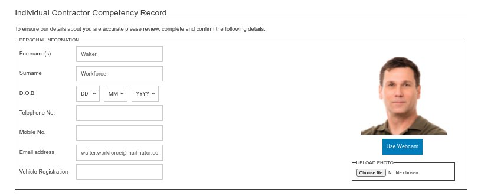

This screen shows the user record. It is the most configurable screen within the system and varies significantly from system to system. It can contain only a minimal amount of fields such as Forename(s), Surname and Induction Profile. It can also extend to several screens of information.

Also the configuration can be linked to the user role. Such that different information can be captured for visitors vs employees or contractors.

The details entered into this screen are confirmed by the end user before being allowed to complete an induction and this consent is retained and audited. 

Below are screen shots and a brief description of each configurable section.