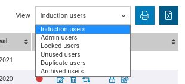
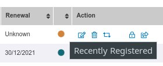
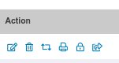

The user management area allows you to perform a number of administrative tasks on behalf of users. From here you can.

* Create new users
* Archive users
* Create admin users
* View / Edit user records 
* etc...

### User Views

At the top of screen the **View** control allows you to choose which user list view you require. 

The view will default to showing you the active Induction users. However you can also change this to look at Administration users, Users that have been archived and are no longer active. As well as some other additional views to help administer the system and keep on top of user licences.

### User List

The main grid shows the list of user data matching the current search bar and also the above mentioned view control. In common with most listing screens this is restricted to the first 50 results, however you can use the pagination control at the bottom of the list to advance to the next page of results. You can export or print the details using the buttons at the top right of the grid.

The columns shown will depend on how your system has been configured but should be similar. There will always be a Username column showing the login username for the user, A Full Name column showing the users first and last names. 

### Status Columns

There are also columns showing the users induction status and renewal date.

The user status is represented by a coloured dot. Float over the dot to see the actual status, however generally speaking a green dot means the users induction is valid, otherwise there is a problem.

### User Actions

Finally at the end of the row is the action column. 

Clicking on each icon allows you to perform a specific action from left to right these are:

* View edit the user's record.
* Mark the user as archived - user is no longer active, and doesn't take up a licence, but user records are still retained.
* Mark the user as requiring an induction renewal.
* Print the user's induction card - only available if induction valid.
* Mark the user's induction as locked / unlock - disable / enable the user from completing an induction.
* Send the user an induction email.